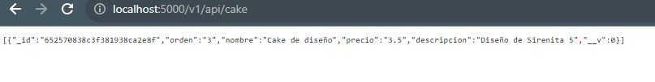

Las rutas para obtner los dato de la base de datos 

http://localhost:5000/v1/api/cake  
http://localhost:5000/v1/api/tradicional 
http://localhost:5000/v1/api/goma 

Datos de cake a elmacenados en la base de datos ingresados desde el sistema  

Para entrar a la pagina completa se ingrea a

http://localhost:4040/

Página inicial 
 

Página de listas, cake, tradicional y gomitas tienen el mismo formato 

Pagina de orden cake, tradicional y gomitas tienen el mismo formato 

Página para enviar presupuesto al personal  
 

Página de información de la empresa 
 
