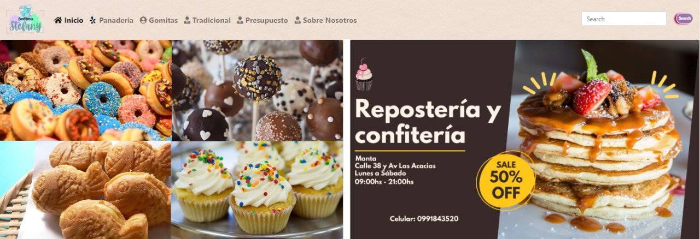
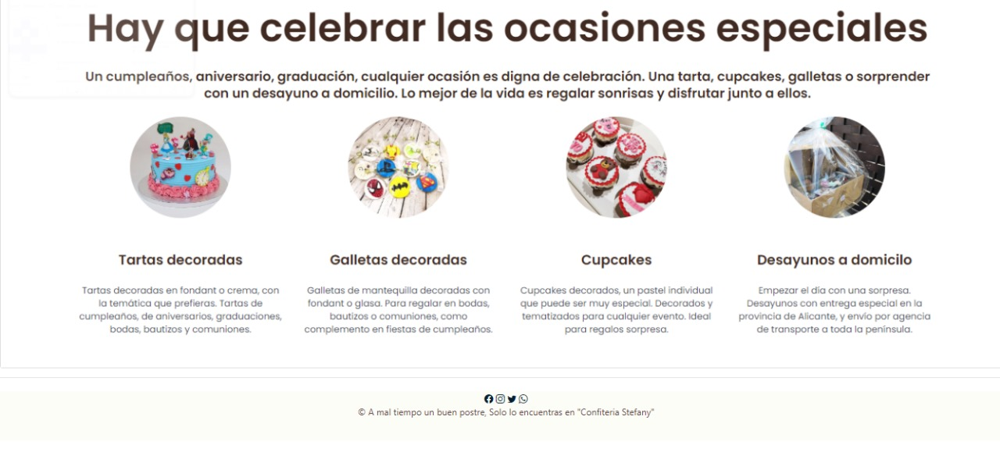
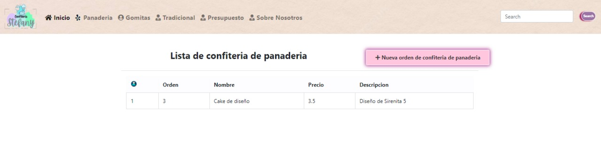
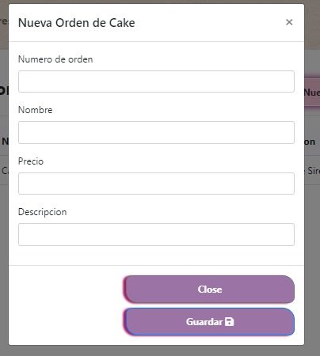
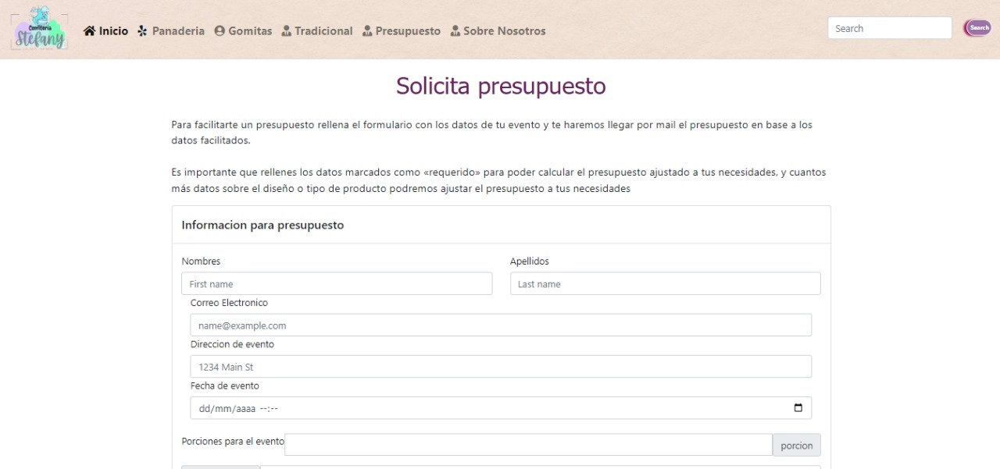
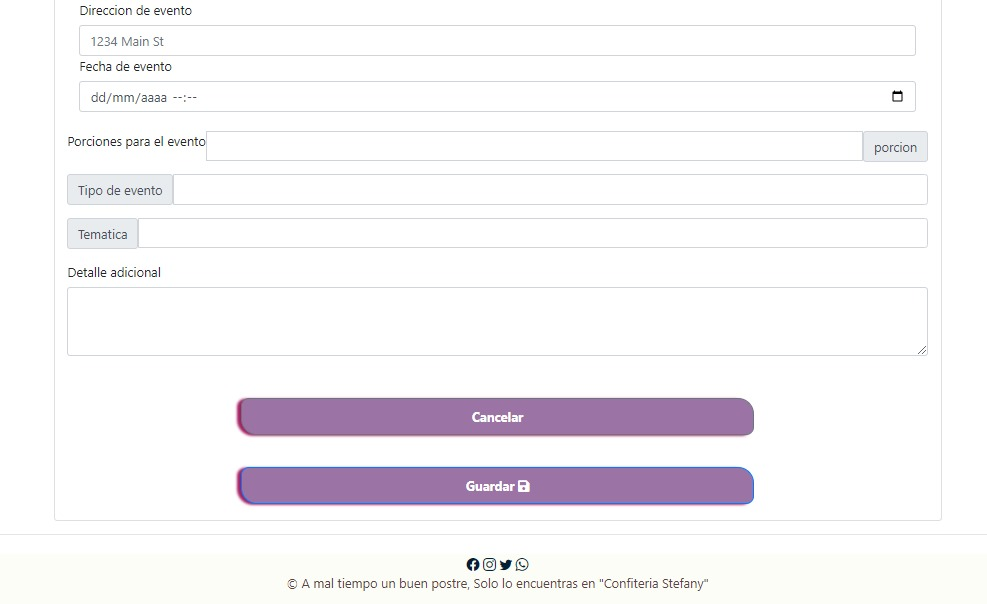
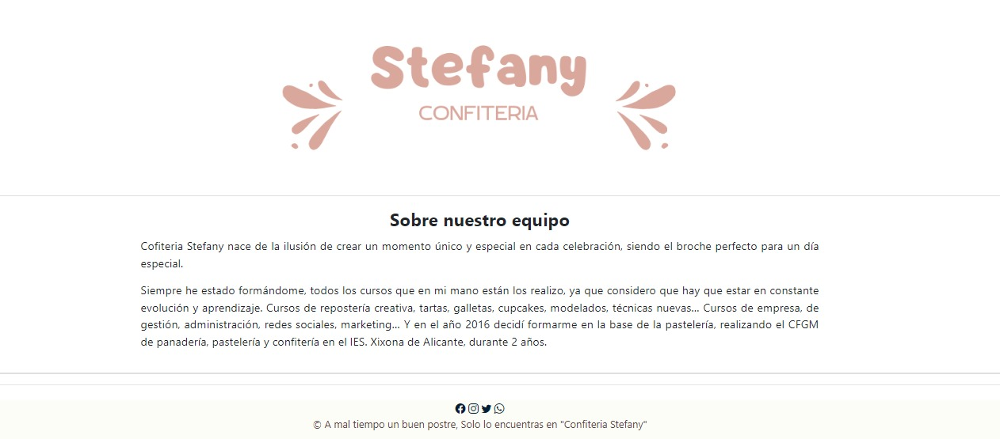

Las rutas para obtner los dato de la base de datos 

http://localhost:5000/v1/api/cake
http://localhost:5000/v1/api/tradicional
http://localhost:5000/v1/api/goma

Datos de cake a elmacenados en la base de datos ingresados desde el sistema

Para entrar a la pagina completa se ingrea a

http://localhost:4040/

Página inicial

Página de listas, cake, tradicional y gomitas tienen el mismo formato

Pagina de orden cake, tradicional y gomitas tienen el mismo formato

Página para enviar presupuesto al personal 

Página de información de la empresa

