# Interfaz del sistema

### Página de Inicio  
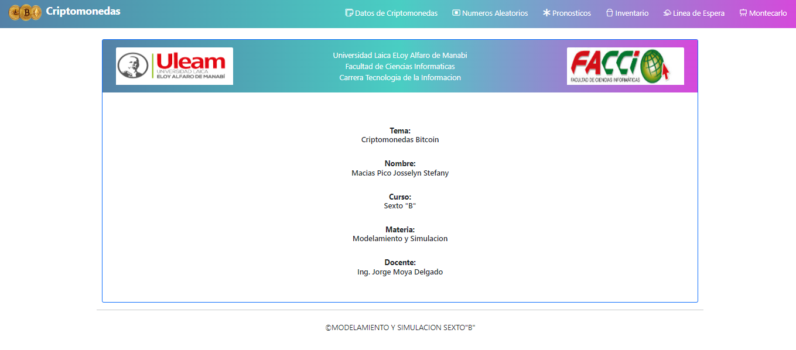

### Datos de criptomonedas  
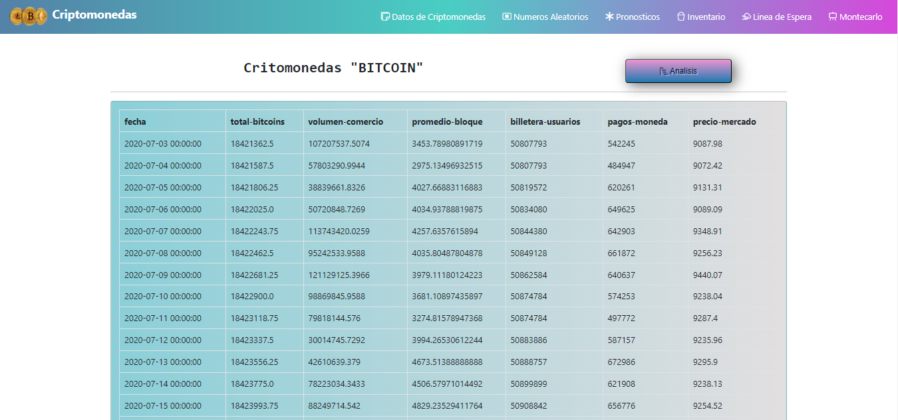

### Análisis gráfico de los datos
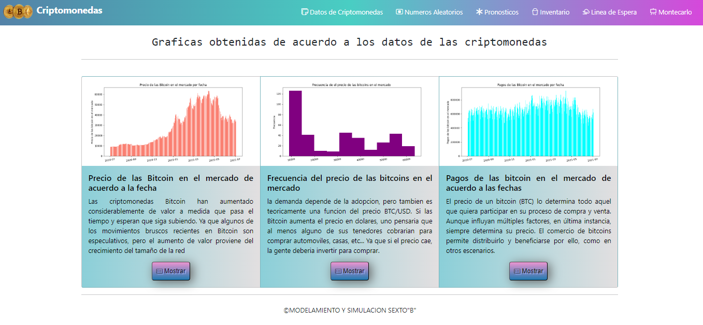

### Informacion realizada con los numeros aleatorios

#### Cuadrados medios
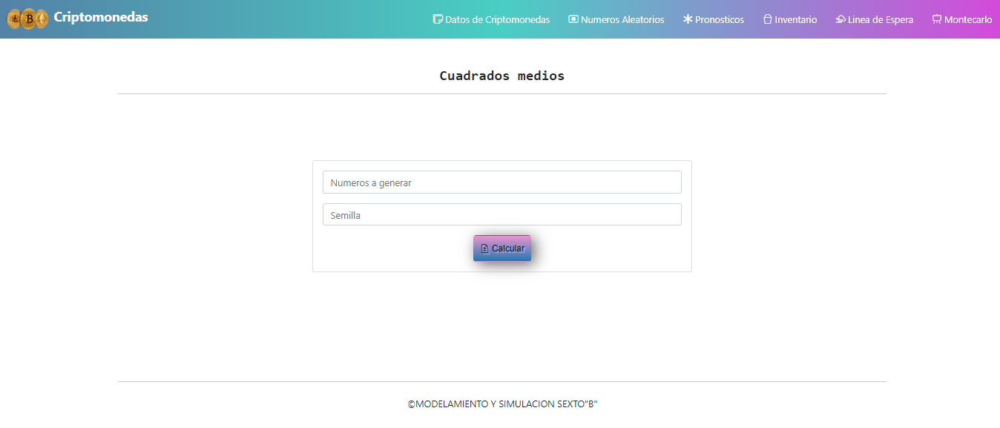

#### Ejemplo de Cuadrados medios
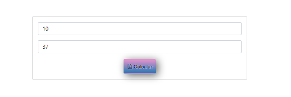
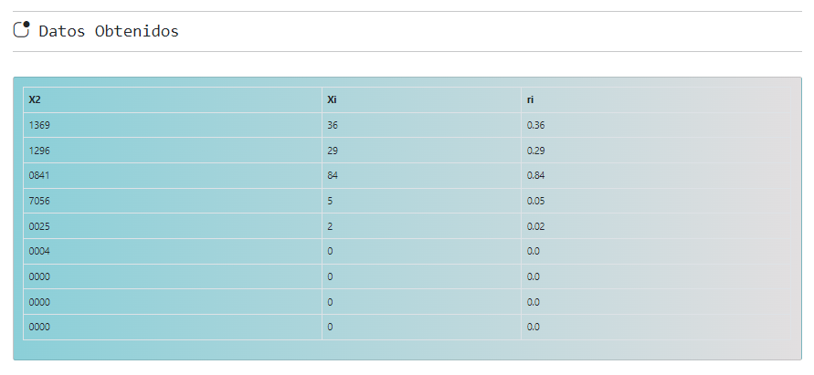
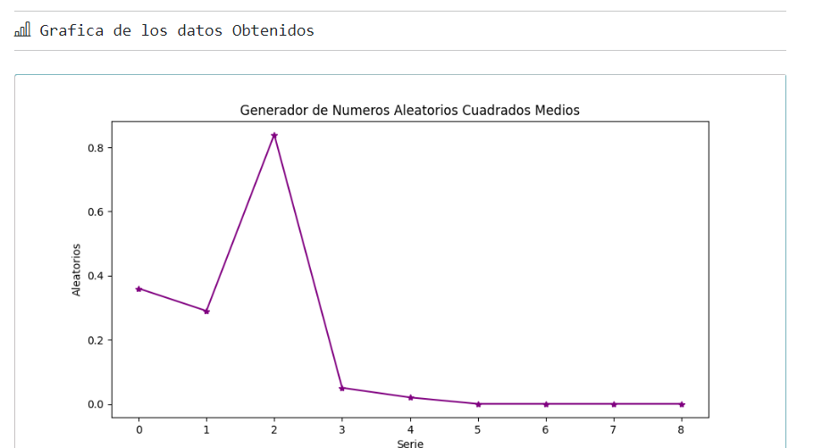

#### Congruencia Lineal
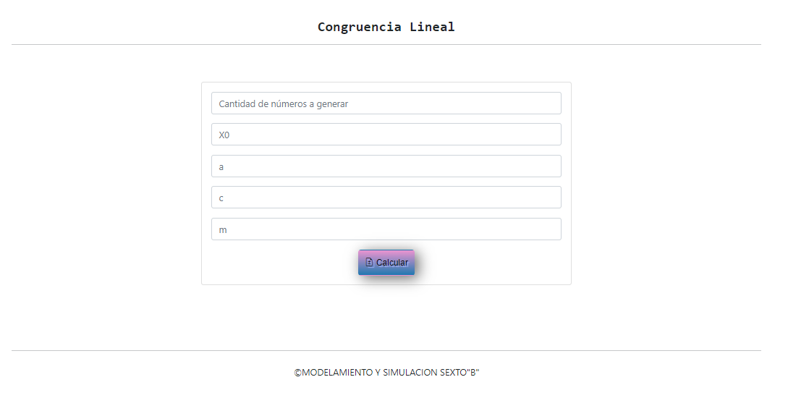

### Congruencia Multiplicativo
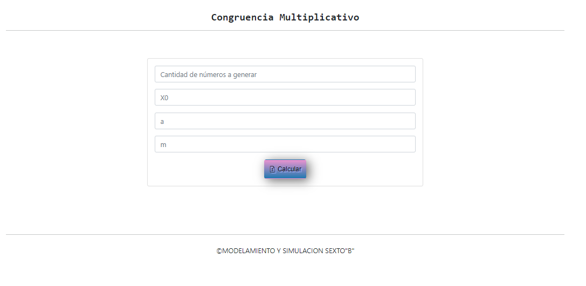

### Distribución de Poisson
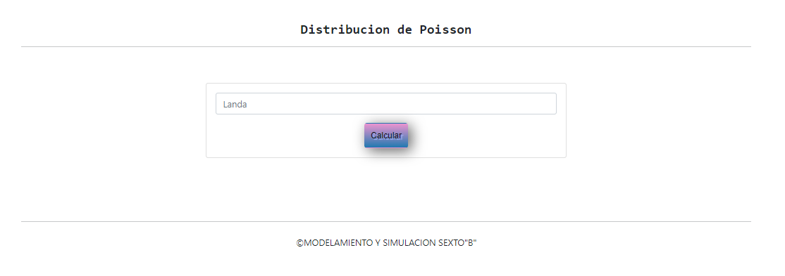

### Página de pronosticos
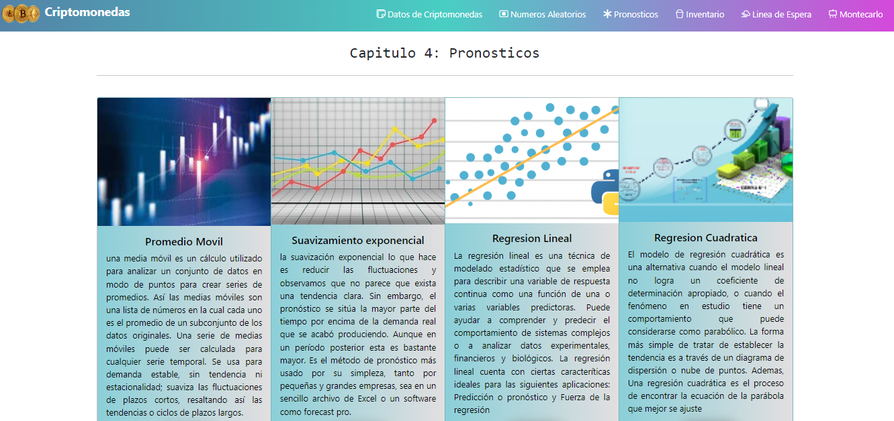

#### Promedio Móvil
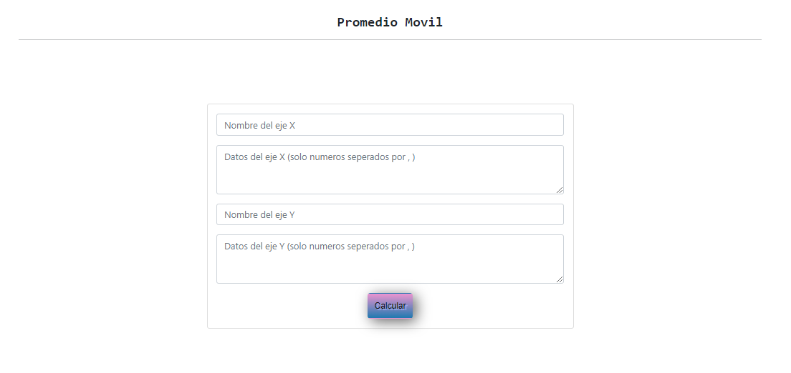

#### Suavización exponencial
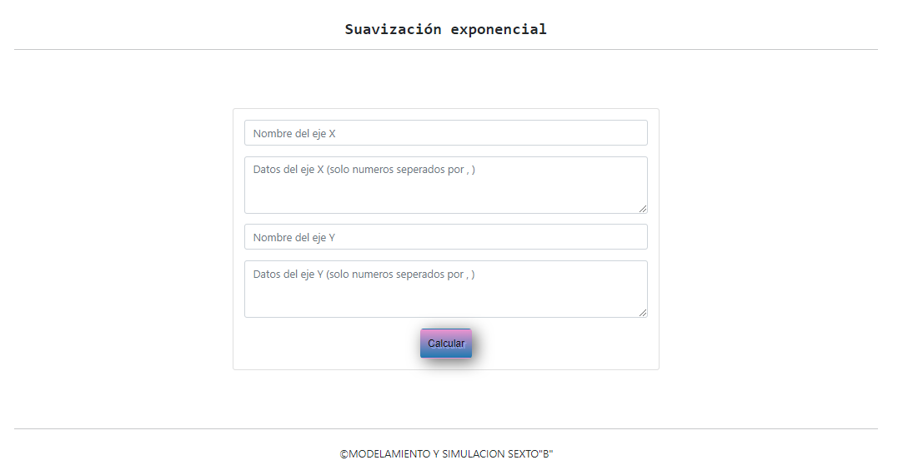

### Página de inventario 
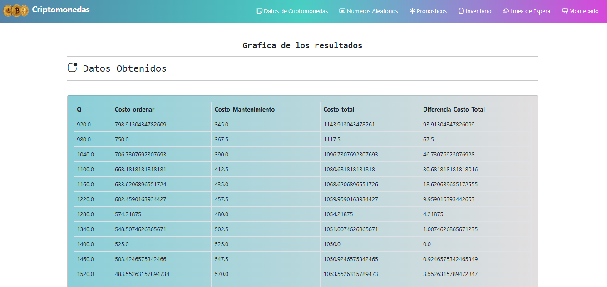
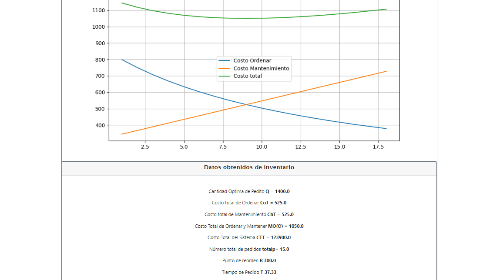

### Línea de espera
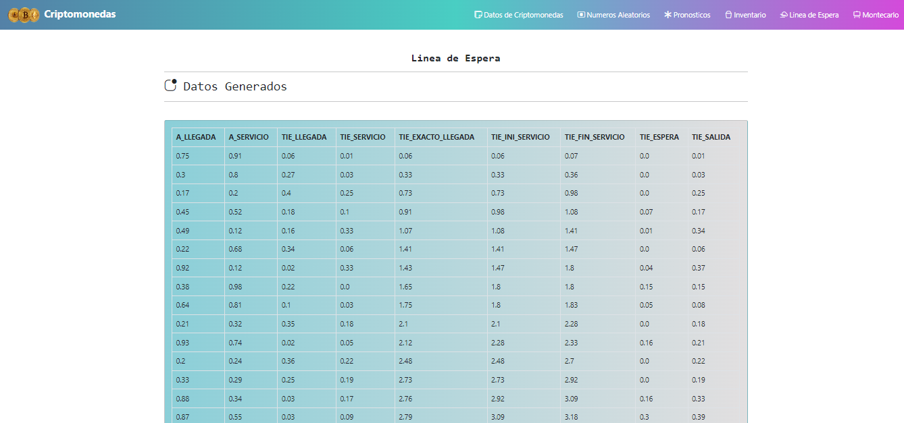
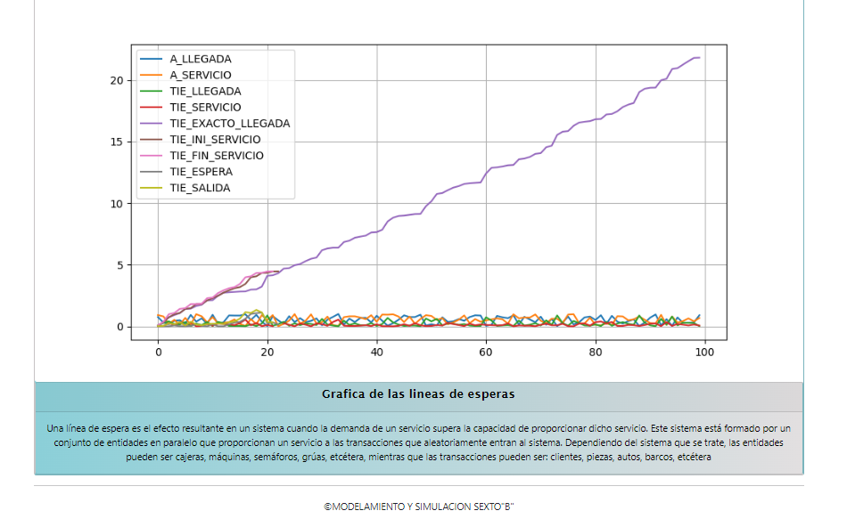

### Montecarlo
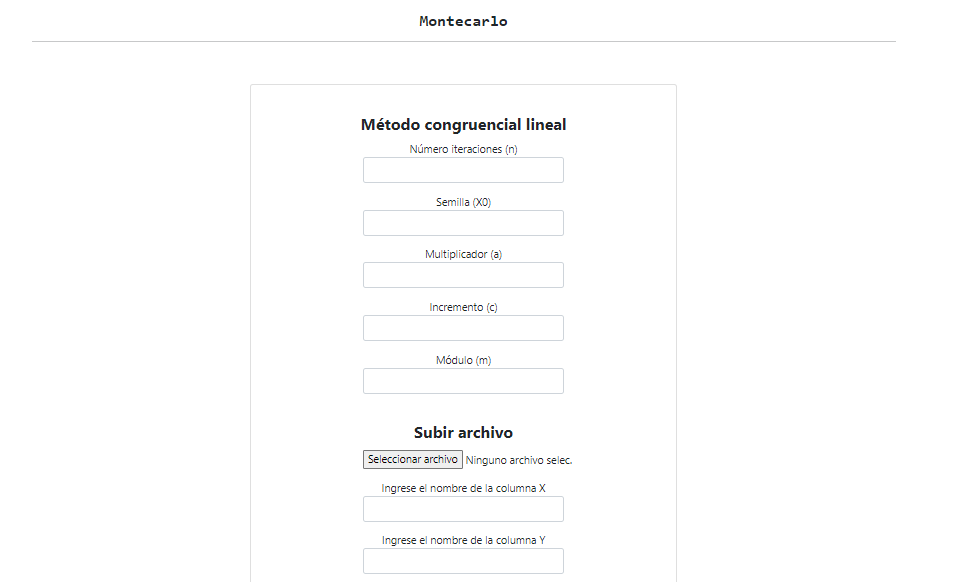
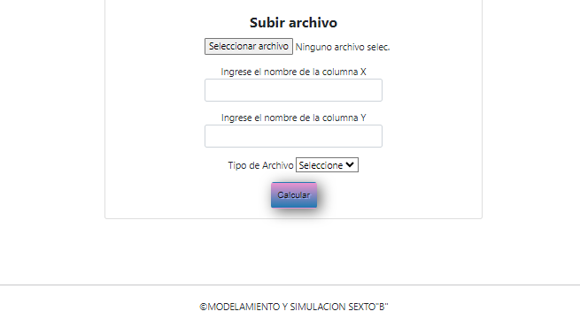